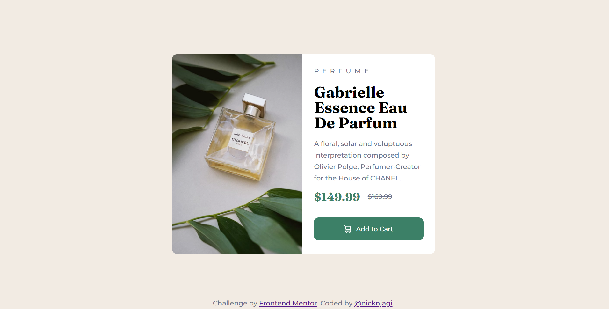

# Frontend Mentor - Product preview card component solution

This is a solution to the [Product preview card component challenge on Frontend Mentor](https://www.frontendmentor.io/challenges/product-preview-card-component-GO7UmttRfa). Frontend Mentor challenges help you improve your coding skills by building realistic projects. 

## Table of contents

- [Overview](#overview)
  - [The challenge](#the-challenge)
  - [Screenshot](#screenshot)
  - [Links](#links)
- [My process](#my-process)
  - [Built with](#built-with)
  - [What I learned](#what-i-learned)
  - [Continued development](#continued-development)
  - [Useful resources](#useful-resources)
- [Author](#author)


## Overview

### The challenge

Users should be able to:

- View the optimal layout depending on their device's screen size
- See hover and focus states for interactive elements

### Screenshot



### Links

- Solution URL: [GitHub repo](https://github.com/nicknjagi/product-preview-card)
- Live Site URL: [https://github.com/nicknjagi/product-preview-card](https://nicknjagi.github.io/product-preview-card/)

## My process

### Built with

- Semantic HTML5 markup
- CSS custom properties

### What I learned

I learned that you can display different images to suit different display sizes using only the HTML picture element.

The code below is how I used it:

```html
  <picture>
            <source srcset="image-product-desktop.JPG" media="(min-width: 375px)"/>
            
        </picture>
```


### Continued development

I am going to continue focusing on responsive web design principles, CSS flexbox and CSS grid.


### Useful resources

- [Resource 1](https://developer.mozilla.org/en-US/docs/Learn/HTML/Multimedia_and_embedding/Responsive_images) - This helped me learn on how to use the picture tag for responsive images.

## Author

- Frontend Mentor - [@nicknjagi](https://www.frontendmentor.io/profile/nicknjagi)
- Twitter - [@nick_njagi](https://www.twitter.com/nick_njagi)


